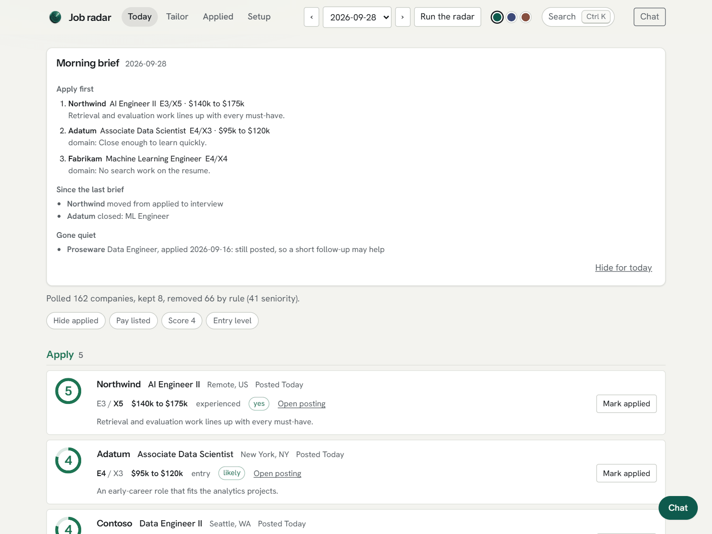
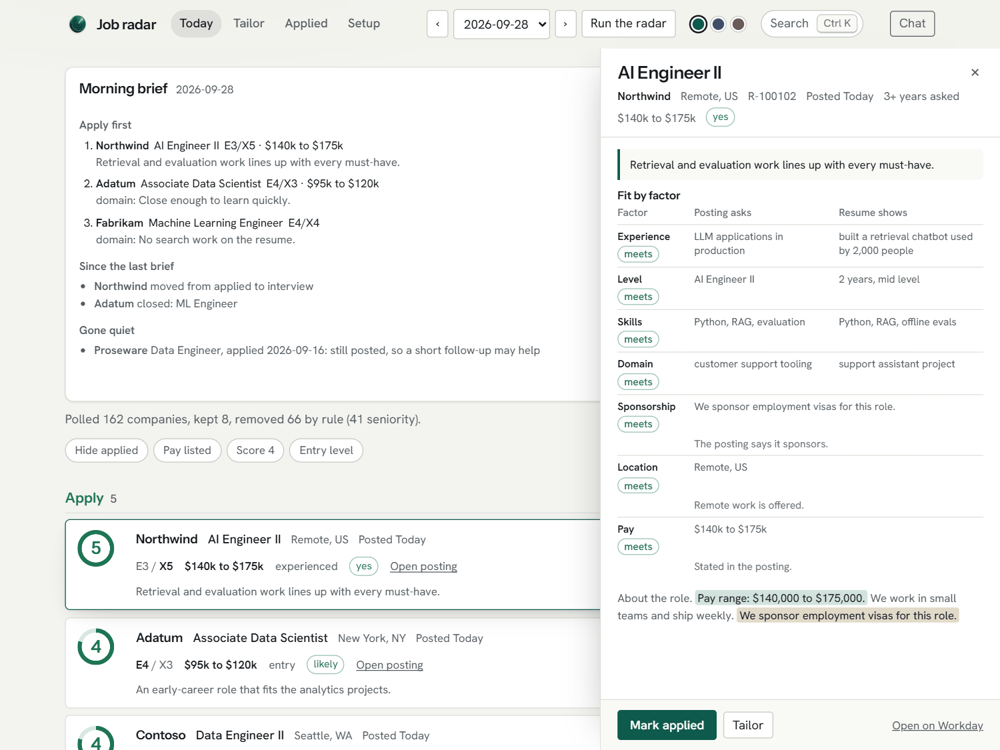
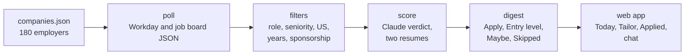
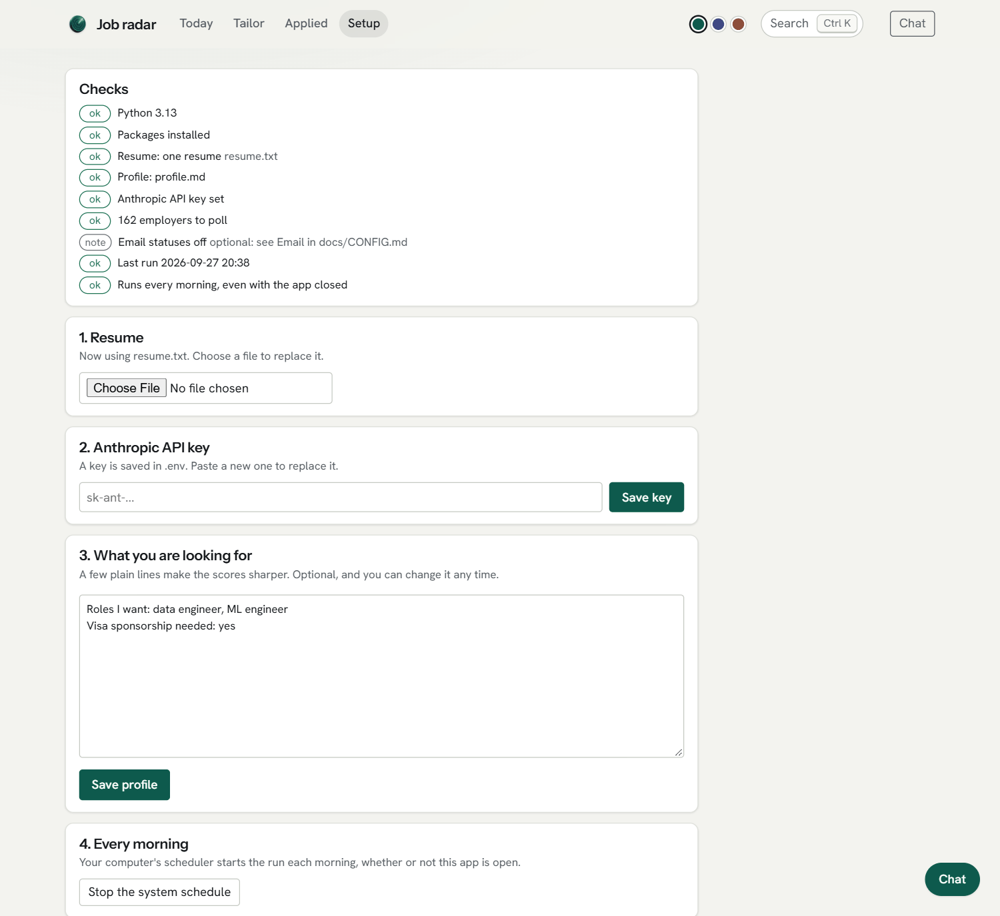
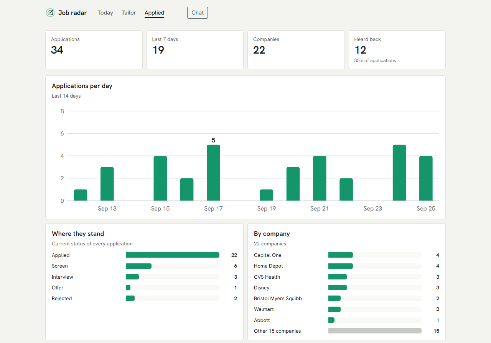

<p align="center"></p>

<h1 align="center">Job radar</h1>

<p align="center"><b>A morning shortlist of data and ML jobs, checked for visa sponsorship one posting at a time.</b><br>
It runs on your laptop, reads employers' own career sites, and tells you what to apply to first.</p>

<p align="center"><a href="docs/media/job-radar-intro.mp4"></a></p>

## Why it helps on a student visa

Searching on a student visa is a second job. Every posting has to be read to the end, because the line that
decides it ("we are unable to sponsor", "U.S. citizens only", "active clearance required") is usually near the
bottom. When your OPT clock is running, a wasted application costs days you do not have.

Job radar does that reading for you, every morning:

- **Sponsorship is read per posting, not guessed per company.** Visa, citizenship and clearance wording sends a
  posting to Skipped, and so do the ads employers run for green card paperwork. When a posting says nothing,
  the employer's public H-1B filing history fills the gap. A company that rarely sponsors can still surface a
  posting that says it will.
- **You see roles the day they are posted.** It reads each employer's own hiring system (Workday, Greenhouse,
  Lever or Ashby) through the same public JSON its careers page uses.
- **Entry-level roles stay visible.** New-grad and early-career postings get their own section, and postings
  that ask for six or more years are dropped before anything is scored.
- **The fit is judged on experience, not keywords.** Each posting is scored against your resume factor by
  factor, experience, level, skills and domain, with what the posting asks next to what your resume shows, so
  you know the gaps before you apply.
- **It never makes things up.** Tailoring a resume for one posting may only reword what is already on it;
  anything new becomes a question for you.

### What a morning looks like

1. At 7:30 the radar reads 180 employers' career sites, one polite request at a time.
2. It keeps the roles you target, sets aside senior, non-US, over-experienced and won't-sponsor postings, and
   scores what is left.
3. You open the app to a short brief: the three postings to apply to first and why, what changed overnight,
   and which applications have gone quiet.
4. You apply and mark it applied. With Gmail connected, hiring emails move it to screen, interview or offer.

The hour of tab-hopping becomes one page you read with your coffee.

<picture>
  <source media="(prefers-color-scheme: dark)" srcset="docs/img/today-dark.png">
  
</picture>

<sub>The Today view, opening with the morning brief. Screenshots and video use demo data and fictional employers. Music: “Feel Alive” by Michael Ramir C., from Mixkit.</sub>

## What it does

- **Reads the source, not a scrape.** Each employer's own hiring system, the same day a role is posted, with the
  real location and the full description.
- **Checks sponsorship per posting**, as above, and keeps the phrase it found so you can see why.
- **Filters on what matters.** Titles must name a target role. Seniority titles, six or more years of required
  experience, contract wording and non-US locations are handled before any scoring.
- **Scores with evidence.** Claude rates each posting 1 to 5 against your resume and shows why, factor by
  factor. Sponsorship, location and pay are read from the posting itself.
- **Tells you what to do first.** The morning brief names the three postings to apply to first, what changed
  since yesterday, and which applications have gone quiet.
- **Tailors without inventing.** On request it rewrites a resume for one posting. Any skill outside the base
  resume and a confirmed skills list is turned into a question instead of added.
- **Reads replies for you.** With a Gmail app password it checks your inbox, read-only, and moves an application
  to screen, interview, rejected or offer when an email carries its requisition id and says so plainly. Replies
  without one wait in a needs-review list for you to settle; plain confirmations are skipped.
- **Shows what your rejections have in common.** Group your applications by role, level, resume, fit score, years
  asked, sponsorship or company, see which groups are rejected more often than your average, in plain words, and
  open a group to see the applications behind it.
- **Watches what you applied to.** It re-checks each posting behind an open application and tells you when one
  closes, which is often the only answer you get.
- **Stays on your machine.** Resumes, applications and chat history are local files, ignored by git.



<sub>Any posting opens in a drawer with its fit, factor by factor. Demo data.</sub>

## How it works



1. `radar.poll` searches every Workday employer with four role terms, plus three entry-level terms for the
   daily tiers, and fetches the detail record for each new posting. A Greenhouse, Lever or Ashby board is read
   whole in one request.
2. `radar.filters` and `radar.sponsor` apply the title, seniority, location, years and sponsorship rules.
3. `radar.score` asks Claude for a strict JSON verdict on each new posting, entry-level ones first, up to
   `score_cap` a run.
4. `radar.digest` writes `digests/<date>.md` and the sections the web app shows.
5. `radar.mail` and `radar.watch` then read hiring emails and re-check the postings behind open
   applications.
6. `server.py` serves the app from `web/` and starts the day's run at `run_time` while it is open.

Employers are tiered, and how deep each tier is searched is set in `config.json`. At one request every 1.5
seconds, a full run of every tier takes about an hour.

## Get started

You need Python 3.11 or newer ([python.org](https://www.python.org/downloads/); on Windows, tick "Add
python.exe to PATH" in the installer) and an Anthropic API key from
[console.anthropic.com](https://console.anthropic.com). Then download this repository (Code, then Download
ZIP) or clone it, and pick the way you like to work.

### In the browser

Double-click `start.bat` on Windows or `start.command` on macOS, or run `./start.sh` on Linux. The first start
takes about a minute to set itself up, then the app opens at http://localhost:8000 on its Setup page:

1. Add your resume. A Word file works best, because it is also the template for tailored versions.
2. Paste your API key. It is checked, then saved only in `.env` on your computer.
3. Write a few lines on what you are looking for.
4. Press **Run the radar**.



From then on it runs every morning at 7:30 while the app is open, and catches up when you open it after the
computer was off. To run even when the app is closed, turn on **Every morning** on the Setup page. `python -m radar.doctor` says what is missing whenever something does not work.

### With a coding assistant

Open the folder in Claude Code, or any assistant that reads `AGENTS.md`, and type `/radar-setup`. It checks
the setup, asks what you are looking for, and tunes the search with you. After that:

| Command | What it does |
| --- | --- |
| `/radar-today` | The day's shortlist, and the three to apply to first |
| `/radar-run` | Run the radar now |
| `/radar-evaluate <link>` | Judge one posting against your resume |
| `/radar-tailor <company> <req_id>` | A tailored resume draft for one posting |
| `/radar-applied` | Record an application or a reply |
| `/radar-mail` | Read hiring emails and update statuses |
| `/radar-add <employer> [link]` | Add an employer to the daily search |
| `/radar-score` | Score new postings with the assistant itself, no API key needed |
| `/radar-tune <what>` | Change what it looks for, in plain words |

Both ways use the same files, so you can set up in one and use the other.

### What it costs

The radar is free. Scoring and tailoring use your own API key: roughly a cent per scored posting, which is
typically $10 to $20 a month at the default settings. `score_cap` in `config.json` caps a run, and
`"score_batch": true` halves the scoring cost in exchange for results that take up to an hour. With a coding
assistant you can skip the key: the radar finds and filters postings, and `/radar-score` has the assistant judge
them against the same rules, on your assistant plan.

### Email statuses, optional

With a Gmail app password in `.env` it reads hiring emails, read-only, and moves applications forward. See
[docs/CONFIG.md](docs/CONFIG.md#email-statuses-from-hiring-emails).

## Everyday use

| Task | How |
| --- | --- |
| Morning run | Scheduled at 7:30, or `python run.py` |
| Wider window when the list is thin | `python run.py --days 3 --all-tiers` |
| Start a run from the app | **Run the radar**, top right of Today |
| Mark a posting applied | **Mark applied** on its card, then move it between stages on the Applied board |
| Find an application | The search at the top of Applied (press **f**): company, role or status |
| Tailor a resume | Ask the chat ("tailor the second one"), or paste a job link in Tailor |
| Tailor from the terminal | `python -m tailoring.apply <company> <req_id> --cover` |
| Judge any posting | `python -m radar.evaluate <link>` (Workday, Greenhouse, Lever or Ashby) |
| Record an application | `python -m radar.applications add <company> <req_id> <title>` |
| Check the setup | `python -m radar.doctor` |
| The morning brief | Top of Today, or `python -m radar.brief` |
| Add an employer | `python -m companies.add <name> <link to its careers site or board>` |

<picture>
  <source media="(prefers-color-scheme: dark)" srcset="docs/img/applied-dark.png">
  
</picture>

<sub>The Applied view: how many you have sent, how fast, where they stand and where they went. A board below
lets you move each application between stages. Demo data and fictional employers.</sub>

## Privacy

Everything the radar knows about you lives in files on your laptop, and git ignores all of them: your resume,
profile, applications, email statuses and chat history. There is no account, no server run by anyone else, and no
analytics.

What leaves your machine, only to do the job:

- **Anthropic's API**, when scoring or tailoring: the posting text and your resume, under your own key. If you
  score with a coding assistant instead, the same text goes to that assistant.
- **Employers' career sites**: their public job listings only, one request at a time, with a pause between
  requests. It never logs in.
- **Gmail**, only if you connect it: read over IMAP in read-only mode. Nothing is sent, moved or deleted.
- **Google Fonts**, for the web app's two typefaces.

## FAQ

**Does it apply for me?** No. It finds, ranks, tailors and tracks; you press submit. It never sends an
application or an email on your behalf.

**Is the sponsorship call always right?** No. It reads the posting's own wording and the employer's public
filing history, which is guidance, not legal advice. A posting that says nothing is marked likely, unlikely or
unknown from that history, never yes, so check with the employer when it matters.

**What jobs does it look for?** Data Engineer, Data Scientist, ML Engineer and AI Engineer roles, entry to mid
level, in the US. Change `search_terms` and `title_patterns` in `config.json`, or ask a coding assistant with
`/radar-tune`.

**Can I add an employer?** Yes: `python -m companies.add "Name" <link>` with its careers site or any posting on
Workday, Greenhouse, Lever or Ashby, or `/radar-add` in Claude Code. Employers on other hiring systems are not
read yet.

**Do I have to pay for anything?** The radar is free. Scoring uses your own Anthropic API key, roughly a cent a
posting, or your Claude Code plan if you score there with `/radar-score`. See [What it costs](#what-it-costs).

**Does it work outside the US, or for other visas?** Not yet. It keeps US postings only, and its sponsorship
reading is written for US work visas.

## Configuration

`config.json` holds the rules. The ones you are most likely to change:

| Key | What it controls |
| --- | --- |
| `search_terms` | Role searches sent to every employer |
| `entry_terms`, `entry_max_days_ago` | Entry-level searches for tiers 1 and 2, and how far back they look |
| `title_patterns` | A title must match one of these to be kept |
| `exclude_seniority`, `exclude_domain` | Title words that remove a posting |
| `max_days_ago` | How recent a posting must be for the role searches |
| `score_cap` | How many postings are sent to Claude per run |
| `max_pages_by_tier`, `tier3_weekdays` | How deep each tier is searched, and which days tier 3 runs |

`companies.json` lists each employer with its Workday address or job board, a tier, and a default for
whether it sponsors. The posting text always overrides that default. The tools that found and verified
the entries are in `companies/`, and `docs/COMPANIES_REPORT.md` lists every employer.

Every setting and field, with its current value and what changing it does, is in
[docs/CONFIG.md](docs/CONFIG.md).

## Project layout

| Path | What is there |
| --- | --- |
| `start.py`, `start.bat`, `start.command`, `start.sh` | One-step start: sets up `.venv`, checks the setup, opens the app |
| `run.py`, `radar/` | The daily pipeline, the Workday client, filters, scoring and the chat assistant |
| `tailoring/` | Resume planning, rewriting, final cleanup, cover letters and outreach |
| `companies/` | Discovery and verification of employers, and the H-1B filing check |
| `server.py`, `web/` | The local web app: FastAPI and plain HTML, CSS and JavaScript |
| `.claude/commands/`, `CLAUDE.md`, `AGENTS.md` | The coding-assistant commands and their guide |
| `scripts/` | The privacy guard that keeps personal details out of commits |
| `tests/` | Offline tests, no network access |
| `docs/` | Status, design decisions, changelog, UI notes, the companies report, and the intro video in `docs/media/` |

## Working on it

Every change goes through a branch and a pull request, and CI runs ruff and the test suite. Pre-commit
runs the same checks, a secrets scan and a privacy guard before each commit. `CONTRIBUTING.md` has the
working rules, and `docs/DECISIONS.md` records why the bigger choices were made.

```bash
pip install -r requirements-dev.txt
```

```bash
python -m pre_commit run --all-files
```

```bash
python -m pytest -q
```
