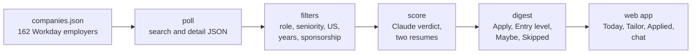

<p align="center"></p>

<h1 align="center">Job radar</h1>

<p align="center"></p>

A morning shortlist of data and ML jobs, pulled straight from company career sites and filtered for
H-1B sponsorship one posting at a time.

Every day at 7:30 it polls 162 employers that hire through Workday. It keeps the Data Engineer, Data
Scientist, ML Engineer and AI Engineer roles that fit an entry-to-mid profile, and drops anything that
says it will not sponsor. The rest are scored against two versions of a resume. A small local web app
shows the result, tracks applications, and can tailor a resume for one posting when asked.

It started as one person's job search, so the defaults are opinionated: data and ML roles, entry to mid
level, US postings that can sponsor a visa. Every one of them lives in `config.json`, and everything
personal stays on your machine in files git ignores.

<picture>
  <source media="(prefers-color-scheme: dark)" srcset="docs/img/today-dark.png">
  
</picture>

<sub>The Today view. Screenshots use demo data.</sub>

## What it does

- **Reads the source, not a scrape.** It calls each company's Workday JSON endpoints directly, the same
  day a role is posted, with the real location and the full description.
- **Checks sponsorship per posting.** Phrases like "will not sponsor" or a PERM-style ad send a posting
  to Skipped, whatever the company's usual policy. A company that usually does not sponsor can still
  surface a posting that does.
- **Filters on what matters.** Titles must name a target role. Seniority titles, six or more years of
  required experience, contract wording and non-US locations are handled before any scoring.
- **Scores with a reason.** Claude rates each survivor 1 to 5 against an entry-level and an experienced
  resume, picks the better base, and writes one line on fit and one on the gap.
- **Keeps junior roles visible.** New-grad and early-career postings get their own Entry level section,
  so a 3 out of 5 on a junior role is not buried under senior roles.
- **Tailors without inventing.** On request it rewrites a resume for one posting. Any skill outside the
  base resume and a confirmed skills list is turned into a question instead of added.
- **Reads replies for you.** With a Gmail app password it checks your inbox, read-only, and moves an application
  to screen, interview, rejected or offer when an email carries its requisition id and says so plainly. Replies
  without one wait in a needs-review list for you to settle; plain confirmations are skipped.
- **Stays on your machine.** Resumes, applications and chat history are local files, ignored by git.

## How it works



1. `radar.poll` searches every employer with four role terms, plus three entry-level terms for the
   daily tiers, and fetches the detail record for each new posting.
2. `radar.filters` and `radar.sponsor` apply the title, seniority, location, years and sponsorship rules.
3. `radar.score` asks Claude for a strict JSON verdict on each new posting, entry-level ones first, up to
   `score_cap` a run.
4. `radar.digest` writes `digests/<date>.md` and the sections the web app shows.
5. `radar.mail` and `radar.watch` then read hiring emails and re-check the postings behind open
   applications.
6. `server.py` serves the app from `web/` and starts the day's run at `run_time` while it is open.

Employers are tiered, and how deep each tier is searched is set in `config.json`. At one request every 1.5
seconds, a full run of every tier takes about an hour.

## Get started

You need Python 3.11 or newer ([python.org](https://www.python.org/downloads/); on Windows, tick "Add
python.exe to PATH" in the installer) and an Anthropic API key from
[console.anthropic.com](https://console.anthropic.com). Then download this repository (Code, then Download
ZIP) or clone it, and pick the way you like to work.

### In the browser

Double-click `start.bat` on Windows or `start.command` on macOS, or run `./start.sh` on Linux. The first start
takes about a minute to set itself up, then the app opens at http://localhost:8000 on its Setup page:

1. Add your resume. A Word file works best, because it is also the template for tailored versions.
2. Paste your API key. It is checked, then saved only in `.env` on your computer.
3. Write a few lines on what you are looking for.
4. Press **Run the radar**.

From then on it runs every morning at 7:30 while the app is open, and catches up when you open it after the
computer was off. `python -m radar.doctor` says what is missing whenever something does not work.

### With a coding assistant

Open the folder in Claude Code, or any assistant that reads `AGENTS.md`, and type `/radar-setup`. It checks
the setup, asks what you are looking for, and tunes the search with you. After that:

| Command | What it does |
| --- | --- |
| `/radar-today` | The day's shortlist, and the three to apply to first |
| `/radar-run` | Run the radar now |
| `/radar-evaluate <link>` | Judge one Workday posting against your resume |
| `/radar-tailor <company> <req_id>` | A tailored resume draft for one posting |
| `/radar-applied` | Record an application or a reply |
| `/radar-mail` | Read hiring emails and update statuses |
| `/radar-tune <what>` | Change what it looks for, in plain words |

Both ways use the same files, so you can set up in one and use the other.

### What it costs

The radar is free. Scoring and tailoring use your own API key: roughly a cent per scored posting, which is
typically $10 to $20 a month at the default settings. `score_cap` in `config.json` caps a run.

### Email statuses, optional

With a Gmail app password in `.env` it reads hiring emails, read-only, and moves applications forward. See
[docs/CONFIG.md](docs/CONFIG.md#email-statuses-from-hiring-emails).

## Everyday use

| Task | How |
| --- | --- |
| Morning run | Scheduled at 7:30, or `python run.py` |
| Wider window when the list is thin | `python run.py --days 3 --all-tiers` |
| Start a run from the app | **Run the radar**, top right of Today |
| Mark a posting applied | **Mark applied** on its card, then move it between stages on the Applied board |
| Tailor a resume | Ask the chat ("tailor the second one"), or paste a Workday job URL in Tailor |
| Tailor from the terminal | `python -m tailoring.apply <company> <req_id> --cover` |
| Judge any posting | `python -m radar.evaluate <workday link>` |
| Record an application | `python -m radar.applications add <company> <req_id> <title>` |
| Check the setup | `python -m radar.doctor` |

<picture>
  <source media="(prefers-color-scheme: dark)" srcset="docs/img/applied-dark.png">
  
</picture>

<sub>The Applied view: how many you have sent, how fast, where they stand and where they went. A board below
lets you move each application between stages. Demo data.</sub>

## Configuration

`config.json` holds the rules. The ones you are most likely to change:

| Key | What it controls |
| --- | --- |
| `search_terms` | Role searches sent to every employer |
| `entry_terms`, `entry_max_days_ago` | Entry-level searches for tiers 1 and 2, and how far back they look |
| `title_patterns` | A title must match one of these to be kept |
| `exclude_seniority`, `exclude_domain` | Title words that remove a posting |
| `max_days_ago` | How recent a posting must be for the role searches |
| `score_cap` | How many postings are sent to Claude per run |
| `max_pages_by_tier`, `tier3_weekdays` | How deep each tier is searched, and which days tier 3 runs |

`companies.json` lists each employer with its Workday tenant, shard and site, a tier, and a default for
whether it sponsors. The posting text always overrides that default. The tools that found and verified
the entries are in `companies/`, and `docs/COMPANIES_REPORT.md` lists every employer.

Every setting and field, with its current value and what changing it does, is in
[docs/CONFIG.md](docs/CONFIG.md).

## Project layout

| Path | What is there |
| --- | --- |
| `start.py`, `start.bat`, `start.command`, `start.sh` | One-step start: sets up `.venv`, checks the setup, opens the app |
| `run.py`, `radar/` | The daily pipeline, the Workday client, filters, scoring and the chat assistant |
| `tailoring/` | Resume planning, rewriting, final cleanup, cover letters and outreach |
| `companies/` | Discovery and verification of employers, and the H-1B filing check |
| `server.py`, `web/` | The local web app: FastAPI and plain HTML, CSS and JavaScript |
| `.claude/commands/`, `CLAUDE.md`, `AGENTS.md` | The coding-assistant commands and their guide |
| `scripts/` | The privacy guard that keeps personal details out of commits |
| `tests/` | Offline tests, no network access |
| `docs/` | Status, design decisions, changelog, UI notes and the companies report |

## Working on it

Every change goes through a branch and a pull request, and CI runs ruff and the test suite. Pre-commit
runs the same checks, a secrets scan and a privacy guard before each commit. `CONTRIBUTING.md` has the
working rules, and `docs/DECISIONS.md` records why the bigger choices were made.

```bash
pip install -r requirements-dev.txt
```

```bash
python -m pre_commit run --all-files
```

```bash
python -m pytest -q
```
