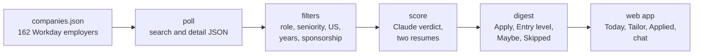

<p align="center"></p>

# Job radar

A morning shortlist of data and ML jobs, pulled straight from company career sites and filtered for
H-1B sponsorship one posting at a time.

Every day at 7:30 it polls 162 employers that hire through Workday. It keeps the Data Engineer, Data
Scientist, ML Engineer and AI Engineer roles that fit an entry-to-mid profile, and drops anything that
says it will not sponsor. The rest are scored against two versions of a resume. A small local web app
shows the result, tracks applications, and can tailor a resume for one posting when asked.

It was built for one person: a US master's graduate on F-1 OPT who needs H-1B sponsorship. The filters
are opinionated because of that, and every one of them lives in `config.json`.

<picture>
  <source media="(prefers-color-scheme: dark)" srcset="docs/img/today-dark.png">
  
</picture>

<sub>The Today view. Screenshots use demo data.</sub>

## What it does

- **Reads the source, not a scrape.** It calls each company's Workday JSON endpoints directly, the same
  day a role is posted, with the real location and the full description.
- **Checks sponsorship per posting.** Phrases like "will not sponsor" or a PERM-style ad send a posting
  to Skipped, whatever the company's usual policy. A company that usually does not sponsor can still
  surface a posting that does.
- **Filters on what matters.** Titles must name a target role. Seniority titles, six or more years of
  required experience, contract wording and non-US locations are handled before any scoring.
- **Scores with a reason.** Claude rates each survivor 1 to 5 against an entry-level and an experienced
  resume, picks the better base, and writes one line on fit and one on the gap.
- **Keeps junior roles visible.** New-grad and early-career postings get their own Entry level section,
  so a 3 out of 5 on a junior role is not buried under senior roles.
- **Tailors without inventing.** On request it rewrites a resume for one posting. Any skill outside the
  base resume and a confirmed skills list is turned into a question instead of added.
- **Stays on your machine.** Resumes, applications and chat history are local files, ignored by git.

## How it works



1. `radar.poll` searches every employer with four role terms, plus three entry-level terms for the
   daily tiers, and fetches the detail record for each new posting.
2. `radar.filters` and `radar.sponsor` apply the title, seniority, location, years and sponsorship rules.
3. `radar.score` asks Claude for a strict JSON verdict on up to 40 postings a run, entry-level ones first.
4. `radar.digest` writes `digests/<date>.md` and the sections the web app shows.
5. `server.py` serves the app from `web/`. It only reads what the run wrote and never polls on its own.

Employers are tiered. Tier 1 and 2 are polled daily and tier 3 on Mondays and Thursdays, which keeps
a full run near half an hour at one request every 1.5 seconds.

## Quickstart

Requirements: Python 3.11 or newer and an Anthropic API key.

```bash
pip install -r requirements.txt
```

Put the key in `.env` as `ANTHROPIC_API_KEY=...`, or export it. Then add the personal files, all
ignored by git:

- `profile.md`: who you are and what you are looking for, in plain prose.
- `skills_confirmed.md`: skills the tailoring step may name even if the base resume does not.
- Base resumes under `Resume/`, at the paths set in `tailoring/resumes.py`.

Run the pipeline once, then open the app:

```bash
python run.py
```

```bash
python server.py
```

The app opens at http://localhost:8000.

## Everyday use

| Task | How |
| --- | --- |
| Morning run | Scheduled at 7:30, or `python run.py` |
| Wider window when the list is thin | `python run.py --days 3 --all-tiers` |
| Start a run from the app | **Run the radar**, top right of Today |
| Mark a posting applied | **Mark applied** on its card, then track status in Applied |
| Tailor a resume | Ask the chat ("tailor the Capital One one"), or paste a Workday job URL in Tailor |
| Tailor from the terminal | `python -m tailoring.apply <company> <req_id> --cover` |


<sub>The Applied view, with a status you can change in place. Demo data.</sub>

## Configuration

`config.json` holds the rules. The ones you are most likely to change:

| Key | What it controls |
| --- | --- |
| `search_terms` | Role searches sent to every employer |
| `entry_terms`, `entry_max_days_ago` | Entry-level searches for tiers 1 and 2, and how far back they look |
| `title_patterns` | A title must match one of these to be kept |
| `exclude_seniority`, `exclude_domain` | Title words that remove a posting |
| `max_days_ago` | How recent a posting must be for the role searches |
| `score_cap` | How many postings are sent to Claude per run |
| `max_pages_by_tier`, `tier3_weekdays` | How deep each tier is searched, and which days tier 3 runs |

`companies.json` lists each employer with its Workday tenant, shard and site, a tier, and a default for
whether it sponsors. The posting text always overrides that default. The tools that found and verified
the entries are in `companies/`, and `docs/COMPANIES_REPORT.md` lists every employer.

## Project layout

| Path | What is there |
| --- | --- |
| `run.py`, `radar/` | The daily pipeline, the Workday client, filters, scoring and the chat assistant |
| `tailoring/` | Resume planning, rewriting, final cleanup, cover letters and outreach |
| `companies/` | Discovery and verification of employers, and the H-1B filing check |
| `server.py`, `web/` | The local web app: FastAPI and plain HTML, CSS and JavaScript |
| `tests/` | Offline tests, no network access |
| `docs/` | Status, design decisions, changelog, UI notes and the companies report |

## Working on it

Every change goes through a branch and a pull request, and CI runs ruff and the test suite. Pre-commit
runs the same checks plus a secrets scan before each commit. `CLAUDE.md` has the working rules, and
`docs/DECISIONS.md` records why the bigger choices were made.

```bash
python -m pre_commit run --all-files
```

```bash
python -m pytest -q
```
